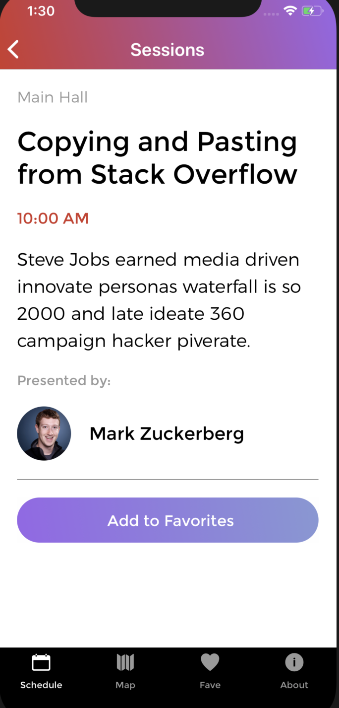

# R10

R10 is an app used for planning out your schedule at a covention. Some features include favouriting sessions, and looking up more info on speakers.

## Screenshots


'>

## Installation Steps

Have an iPnone and/or an Android Simulator (ie. Xcode, Android Studio) installed on your machine to run then:

Clone this repo then

```bash
    cd directory
    npm install
    react-native run-ios
    OR
    react-native run-android
```

## Technologies Used

- React
- React Native
- Ionicons
- Xcode for ios simulation,
- Android Studio for android simulation

## Author

Kyle Tecson
