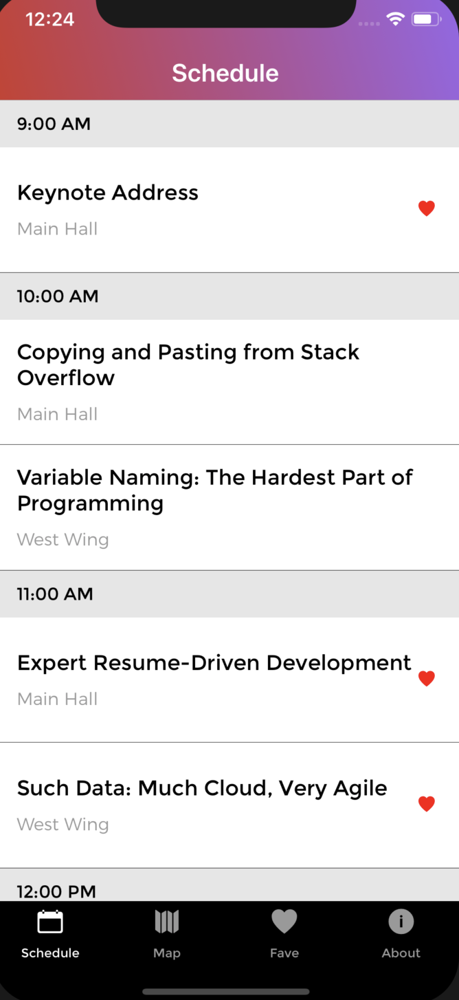
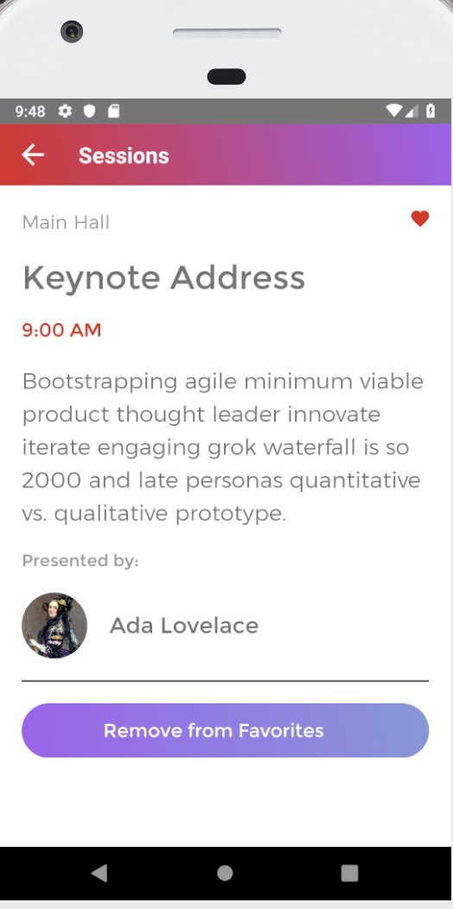

# R10

R10 is a cross platform (iOS/Android) schedule app. Some features of the app include favouriting sessions, viewing more about speakers on wikipedia and viewing the location on google maps.

## Screenshots



'>

## Installation Steps

Have an iPnone and/or an Android Simulator (ie. Xcode, Android Studio) installed on your machine to run then:

- Clone repo
- cd into directory

#### iOS

```bash
  react-native run-ios
```

#### Android

- open android simulator

```bash
react-native run-android
```

## Technologies Used

- React
- React Native
- GraphQL
- Moment
- Xcode for
- Android Studio

## Author

Kyle Tecson
